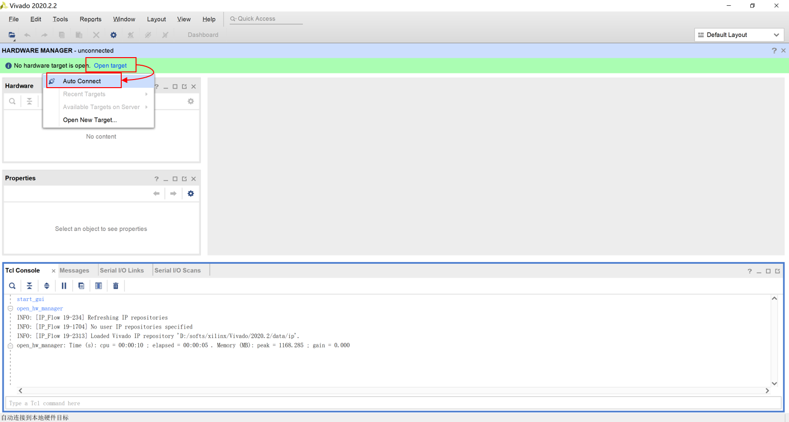

# Module Emulator

Xilinx Spartan7 FPGA is used to emulate the digital part of Altiroc2/3 when the module is not available.  
The board dimension (length and width) and the position of the connectors are the same as the module.

# Module emulator configuration

1. Setup  
Connecting module emulator with modular PEB by flex and FH26 FMC board.

Connecting module emulator with PC by JTAG-HS2 USB programming cable and a special clip. It should be noted that the pin VDD on the cable should be connected with the pin VCC on the special clip, which then should be connected with the pin 2v5 on the module emulator. The other side of the JTAG-HS2 USB programming cable should be connected with PC.

Power up the modular PEB with 11V DC power supply.

2. Configuration  
Run Vivado and open hardware manager. 

Open target and connect the module emulator.

Right click the device(xc7s15_0) and add configuration memory device.

Search for "mx25v8035f" and choose the result, click "OK".

The memory part named mx25v8035f-spi-x1_x2_x4 will appear below your device. Right click it and program configuration memory device.

Choose your configuration file and PRM file. Click "OK" and it will be successfully configured after dozens of seconds.

If you don't have existing configuration file and PRM file, your can create a new project and add your own source files and then generate corresponding configuration files.

